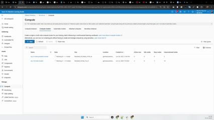
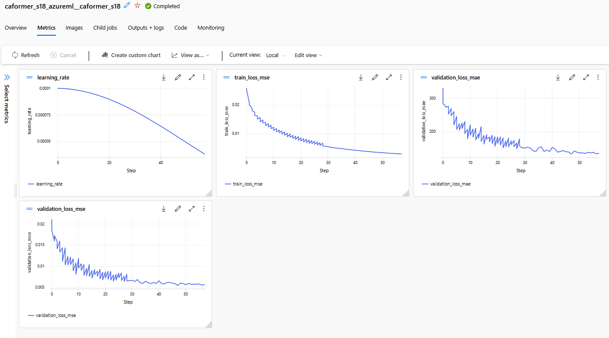

[< Back to MLOps Multi-Cloud Showcases](../README.md)

---

# Geophysical Waveform Inversion Ensemble: A Production-Ready MLOps Blueprint

This repository contains a complete, production-grade MLOps pipeline for training a large ensemble of deep learning models for a complex geophysical inversion task. It is designed not as a simple script, but as a robust, scalable, and cost-effective framework that demonstrates professional MLOps practices.

The core philosophy of this project is **"Local-First, CLI-Driven, and Cost-Aware."** This approach stands in contrast to many notebook-centric tutorials by prioritizing automation, reproducibility, and a development workflow that minimizes expensive cloud usage.

---

## ✨ Visual Highlights

| 1. Intelligent Job Orchestration | 2. Before: Training Failure | 3. After: Resilient Recovery |
| :---: | :---: | :---: |
|  |  |  |
| *Our script intelligently assigns jobs to different compute clusters based on model size, optimizing both cost and performance.* | *Without our solution, a spot instance preemption means all training progress is lost.* | *Our pipeline automatically resumes training from the last checkpoint, saving time and money.* |

---

## 🏛️ Project Structure

This project follows the standard architecture defined in the main portfolio. Here is a more detailed look at the key files and directories:

```text
Geophysical-Inversion-Ensemble/
├── README.md               # You are here!
├── requirements.txt        # All Python packages needed for this project
│
├── configs/
│   └── model_configs.yml     # Defines the model portfolio and all hyperparameters
│
├── data/                   # (Ignored by git) For local data files
│   └── geo_aware_splits.json # Defines data splits without duplicating source data
│
├── outputs/                # (Ignored by git) For local outputs like models or logs
│
├── scripts/
│   ├── check_jobs.py         # Checks status of Azure ML jobs
│   ├── create_file_splits.py # Generates data splits for ensemble training
│   ├── run_azureml.py        # Submits a single job to Azure (used by the orchestrator)
│   └── train_all_models.py   # The main orchestrator you run locally
│
└── src/
    ├── data_utils.py       # Utility functions for data handling
    ├── dataset.py          # The PyTorch Dataset class
    └── timm_unet.py        # The core U-Net model architecture
```

---

## 💡 Core Concept: Implementing the "Shopping List" Method

As described in the main portfolio `README.md`, this project avoids costly data duplication by using a "pointer-based" data handling method. Here is how it's specifically implemented:

1.  **Central Data Store:** All large `.npy` data files are stored once in a central **Azure Blob Storage** container.
2.  **Data Asset Registration:** This container is registered in Azure Machine Learning as a single, reusable **Data Asset**.
3.  **The "Shopping List":** The `data/geo_aware_splits.json` file in this repository acts as the "shopping list." It's a small JSON file containing lists of file paths relative to the root of the Data Asset. It defines 16 different training/validation splits.
4.  **Job Execution:** When an Azure ML job is launched, it mounts the central Data Asset (read-only) and is given the `geo_aware_splits.json`. The PyTorch `Dataset` class then reads this JSON to know which specific files to load from the mounted asset for that particular run.

This architecture ensures that even when running 16 parallel jobs, the large source data is never copied. Only the tiny JSON "shopping list" is used to orchestrate data access, making the entire process fast, scalable, and cost-effective.

---

## Key Features & Philosophy

This project isn't just about the final model; it's about the **machinery** that builds it. Here are the core features that embody its design philosophy:

*   **💻 Local-First Development:** Catch bugs on your local machine before they waste time and money in the cloud. The entire pipeline can be tested end-to-end with a dummy dataset.
*   **🤖 CLI-Driven Automation:** Every step, from data preparation to launching dozens of training jobs, is executed via the command line, making it perfect for automation and CI/CD integration.
*   **💰 Cost-Effective by Design:** The architecture is built from the ground up to leverage cheap **Azure Spot Instances**, with an intelligent, automatic recovery mechanism to handle preemptions without losing work.
*   **⚙️ Configuration-Driven Pipeline:** Easily experiment with dozens of models and hyperparameters by editing a single YAML file (`configs/model_configs.yml`), with no code changes required.
*   **🧩 Decoupled & Scalable Architecture:** The project is cleanly separated into `src` (core logic), `scripts` (executable actions), and `configs` (definitions), making it easy to maintain and scale.

---

## How It Works: The 3-Tier Architecture

The pipeline is orchestrated through a simple but powerful 3-tier system:

1.  **Tier 1: The "What" - Centralized Configuration (`configs/model_configs.yml`)**
    *   This human-readable YAML file is the "menu" for all our experiments. It defines every model, its hyperparameters, and even specific compute resources to use for larger models.

2.  **Tier 2: The "How" - The Local Orchestrator (`scripts/train_all_models.py`)**
    *   This is the master script you run from your local machine. It reads the YAML config, loops through each model, and intelligently calls the job submitter for each one. You can use it to launch the entire portfolio of 16+ models with a single command.

3.  **Tier 3: The "Action" - The Cloud Job Submitter (`scripts/run_azureml.py`)**
    *   This is a generic, reusable script that takes parameters from the orchestrator and submits a single training job to Azure Machine Learning. It's completely decoupled from the specific models being trained.

---

## Quickstart: Running the Pipeline

Follow these steps to set up and run the entire training pipeline.

### 1. Prerequisites

*   Python 3.8+
*   An Azure account and the Azure CLI installed (`az login`).
*   Your Azure ML Workspace `config.json` file placed in the root of this project folder.
*   Your training data uploaded to an Azure Blob Storage container and registered as a Data Asset in your Azure ML Workspace (e.g., `azureml:train-samples-asset:1`).

### 2. Setup

Clone the repository and install the required packages:

```bash
git clone https://github.com/your-username/MLOps-MultiCloud-Showcases.git
cd MLOps-MultiCloud-Showcases/Geophysical-Inversion-Ensemble
pip install -r requirements.txt
```

### 3. Generate Data Splits

**Purpose:** To generate diverse train/validation data splits required for robust ensemble training. This script creates the `data/geo_aware_splits.json` file, which defines 16 unique views of the training data without duplicating any of the large `.npy` files.

**Action:**
```bash
python scripts/create_file_splits.py
```
*(You will need to have created the `file-splits-asset` in Azure ML from the generated JSON file for the pipeline to work)*

### 4. Local Pre-flight Check (The Core of "Local-First")

This two-step process is crucial for catching errors locally before they waste cloud resources.

**A. Create a Local Test Dataset**

First, generate a small, structurally-correct sample dataset. This script creates it in the `dummy_dataset/` folder. While named "dummy", this data is vital for ensuring the entire data loading and model pipeline works correctly on your local machine.

```bash
python scripts/create_dummy_data_set.py
```

**B. Run the Sanity Check**

Now, run the sanity check script. It will automatically use the dataset created in the previous step to perform a full, end-to-end test on every model defined in `configs/model_configs.yml`.

```bash
python scripts/sanity_check_all_models.py
```
This local validation loop is the most effective way to develop quickly and save on cloud costs.

### 5. Launch Cloud Training Jobs

**Purpose:** This is the main **orchestrator script** for launching the cloud training jobs. It reads the `configs/model_configs.yml` file and submits one Azure ML job for each model defined.

**Action:**
```bash
# Launch all jobs on the default compute cluster
python scripts/train_all_models.py --auto_confirm

# Or, launch specific jobs on a specific cluster
python scripts/train_all_models.py --models caformer_b36 convnext_large --compute_name "my-powerful-gpu-cluster" --auto_confirm
```

### 6. Monitor and Debug

**Purpose:** To monitor the status of your Azure ML jobs directly from the command line, without needing to open the UI.

**Action:**
```bash
python scripts/check_jobs.py
```

---

## The Secret Sauce: Resilient Training on Spot Instances

The ability to use cheap Spot Instances without fear is the core of this project's cost-effectiveness. This is achieved in `src/train_multi_gpu.py` through two key functions:

1.  **Comprehensive Checkpointing:** The script saves not just the model weights, but the entire training state: the optimizer state, learning rate scheduler state, current epoch number, and even the early stopping patience counter.
2.  **Automatic Recovery:** If a job is preempted (killed) by Azure, the `download_snapshot_from_previous_run` function in the new job automatically scans the experiment's history, finds the snapshot from the last failed run, downloads it, and resumes training exactly where it left off. This turns a potentially catastrophic failure into a minor delay.
