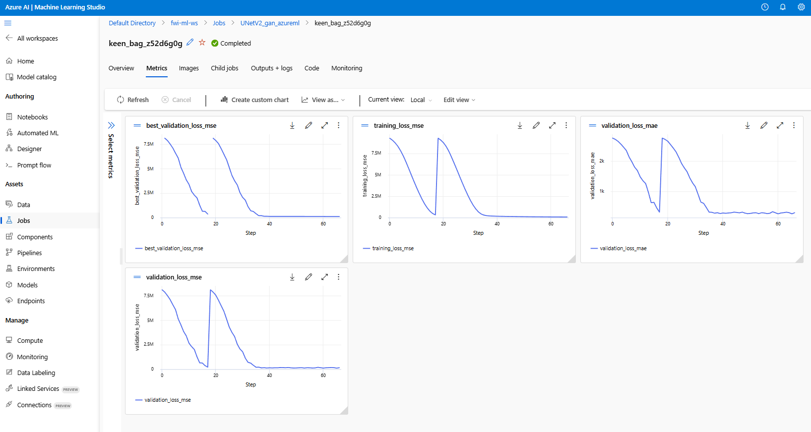

# MLOps Multi-Cloud Showcases

Welcome to my portfolio of production-grade MLOps projects. This repository is dedicated to demonstrating end-to-end, real-world machine learning operations across various cloud platforms (Azure, AWS, GCP) and problem domains (Ensemble Training, LLMs, etc.).

The core philosophy is to move beyond simple notebooks and build robust, automated, and cost-effective systems that mirror professional industry standards.

---

## 🚀 Project Portfolio

### 1. Geophysical Waveform Inversion Ensemble (Azure)

A resilient, scalable pipeline for training a large ensemble of deep learning models on **Microsoft Azure**. This project is a masterclass in cost-effective, automated training using spot instances.

*   **☁️ Cloud:** `Microsoft Azure`
*   **⚙️ Key Technologies:** `Azure ML SDK v2`, `PyTorch`, `DDP`, `Spot Instances`, `CLI Automation`, `MLflow`
*   **✨ Highlights:**
    *   Fully automated, CLI-driven workflow.
    *   Intelligent, automatic recovery from spot instance preemptions.
    *   Configuration-driven design to manage 16+ models easily.

➡️ **[View Project Details](./Geophysical-Inversion-Ensemble/README.md)**

---

## ✨ Showcase in Action: Geophysical Inversion on Azure

Here is a visual summary of the key outcomes from the first showcase project, demonstrating the core MLOps principles of automation and resilience in action.

### 1. Intelligent Job Orchestration & Scaling

Our orchestrator script reads the model configurations and intelligently assigns jobs to different compute clusters based on their requirements. With a single command, it can scale up multiple clusters to run the entire experiment portfolio in parallel, optimizing for both cost and performance.


---

### 2. The Spot Instance Challenge: Before vs. After

The core value of this pipeline is its ability to handle spot instance preemptions gracefully.

| Before: Training Failure | After: Resilient Recovery |
| :---: | :---: |
|  |  |
| *Without our solution, a preemption means all training progress is lost, wasting hours of compute time.* | *Our pipeline automatically resumes training from the last checkpoint, turning a catastrophic failure into a minor delay.* |

---

## 🏛️ Standard Project Architecture

All projects in this showcase follow a consistent, decoupled structure. Below is a typical project layout, using the first showcase as an example.

```text
MLOps-MultiCloud-Showcases/
├── .gitignore
├── README.md               # You are here! The main portfolio entry point.
│
└── Geophysical-Inversion-Ensemble/  # An example project
    ├── README.md           # Project-specific description, setup, and results
    ├── requirements.txt    # Python dependencies for this specific project
    │
    ├── configs/            # The Brain: All experiment configurations
    │   └── model_configs.yml
    │
    ├── data/               # Holds data *definitions*, not large data files
    │   └── geo_aware_splits.json
    │
    ├── src/                # The Library: Core, reusable source code
    └── scripts/            # The Command Center: Executable runner scripts
```

### Core Principles

*   **Configuration-Driven:** All experiments are defined in simple config files (`configs/`), separating parameters from logic.
*   **CLI-Driven Automation:** Every task is executed via command-line scripts (`scripts/`), making the entire process automatable and CI/CD-friendly.
*   **Decoupled Source Code:** Core logic (`src/`) is developed as a reusable library, cleanly separated from the execution scripts.
*   **Efficient Data Handling (The "Shopping List" Method):**
    *   A critical principle in this portfolio is to **avoid redundant data copies**. The `data/` directory holds small definition files (like a JSON "shopping list"), not the large datasets themselves.
    *   The large data files are stored once in a central cloud storage location. The "shopping list" simply *points* to the specific data files required for a run.
    *   This dramatically saves on storage costs, network overhead, and job startup times, especially when running dozens of experiments in parallel.